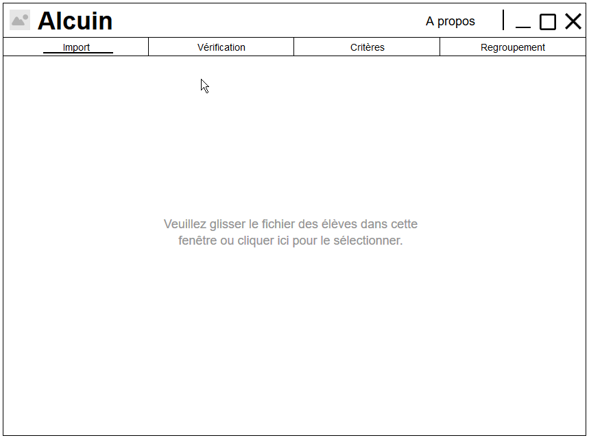
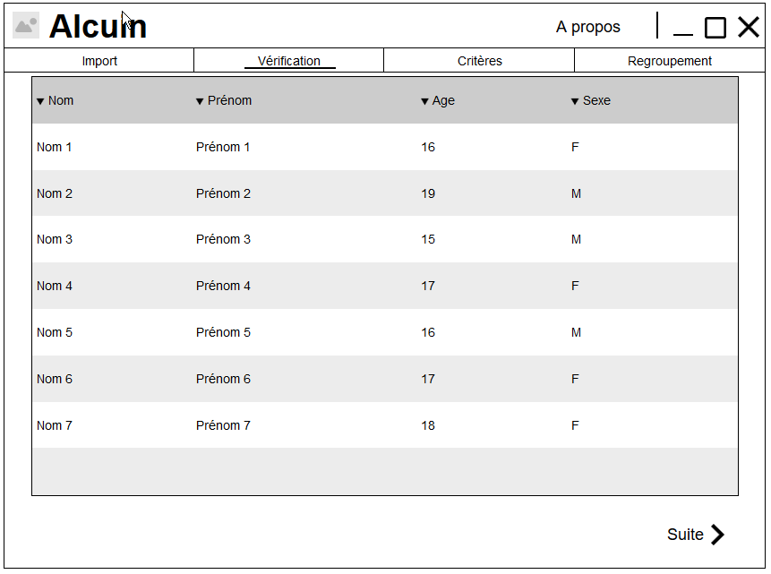
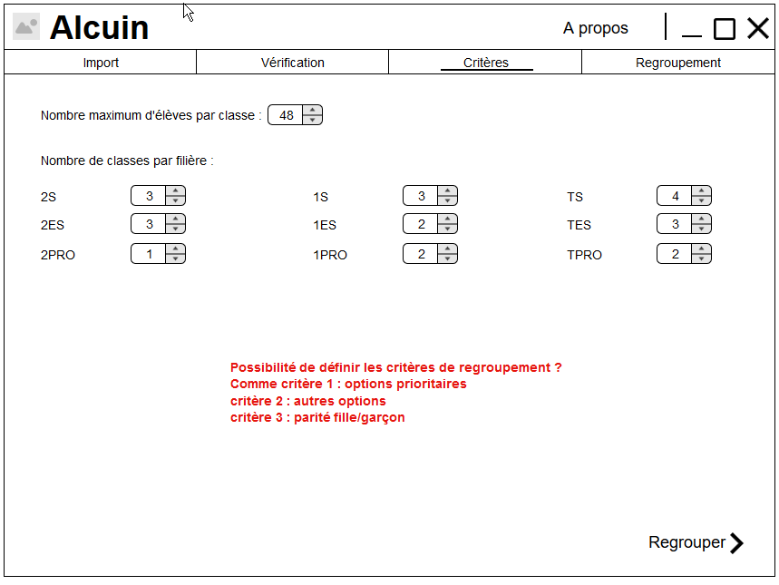
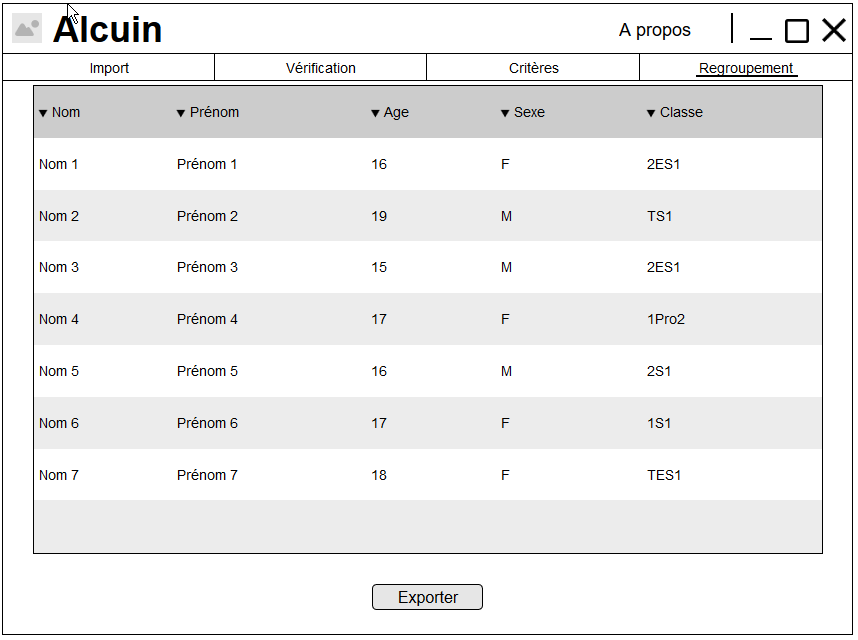
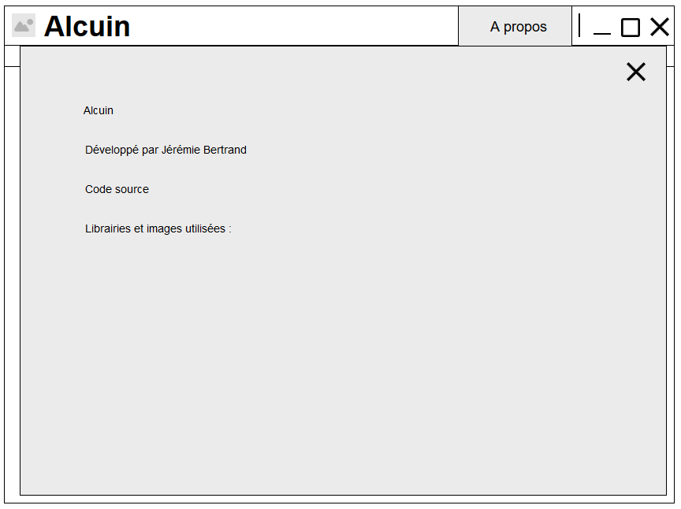

# Alcuin

## Spécification fonctionnelle
**Jérémie Bertrand**  
Dernière mise à jour : 11 novembre 2015
___
### Vue d'ensemble
Alcuin est un logiciel permettant à un Conseiller Principal d'Education de former ses classes en regroupant les élèves par option.

Le nom [Alcuin](https://fr.wikipedia.org/wiki/Alcuin) a été choisi pour la relation du personnage avec Charlemagne et l'univers de l'enseignement.

**Cette spécification n'est en aucun cas complète.**  
Toute la formulation devra être révisée à plusieurs reprises avant d'être finalisée. Les graphiques et écrans montrés ici illustrent simplement les fonctionnalités. Le look et l'utilisation finaux seront développés au fil du temps avec les retours des utilisateurs.

### Scénarios

**Scénario 1 : Benoît**   
Benoît est CPE. Dans un lycée public. Et comme l'éducation national n'a pas de budget, il galère chaquer année avec excel lors de la répartition des élèves dans les classes. Mais heureusement pour lui un ami lui parle du logiciel Alcuin qui fait ça simplement. Après avoir convaincu le directeur que le lycée allait gagner en productivité, Benoît peut utiliser Alcuin. Et Benoît est enfin heureux.

**Scénario 2 : Norah**  
Norah est CPE. Dans un lycée privé. C'est sa seconde année et l'année précédente, pour se faire accepter, elle s'est rapprochée de certains élèves. Et elle a promis à son élève préféré qu'il serait avec ses amis. Dans un lycée aussi grand, cela peut être compliqué. Mais elle utilise Alcuin, qui permet facilement de le changer de classe et de faire en sorte qu'il soit avec ses amis.

### Ce qu'il n'est pas
Cette version ne supportera pas les formats inconnus de fichiers lors de l'import des élèves.  
Cela pourra faire l'objet d'une version ultérieure.

### Présentation globale

Schéma d'enchaînement des écrans :

Import des données -> Revue des élèves -> Définition des critères -> Regroupement

A propos   

Maquette cliquable : https://app.moqups.com/laedit/zNkxFDqQxs/view

### Ecran par écran 

#### Import des données
 

Permet d'importer un fichier excel produit par le logiciel SIECLE via :
 - un glisser / déposer du fichier dans la fenêtre
 - un clic sur le texte ouvrira une fenêtre de sélection de fichier 

#### Revue des élèves

Permet de vérifier les données des élèves importés et de les modifier si nécessaire.  
Le clic sur le bouton "suite" permet d'accéder au prochain écran.

#### Définition des critères

Permet de définir les différents critères  utilisées pour le regroupement des élèves en classes.  
Le clic sur le bouton "regrouper" lance le regroupement et passe au prochain écran.

#### Regroupement

Permet de vérifier que le regroupement correspond à ce qui était attendu et à changer les élèves de classe si besoin.  
Le clic sur le bouton "exporter" permet d'exporter les données (élèves + classes) dans un fichier excel au format compréhensible par SIECLE.

#### A propos

Affiche des informations sur :
 - le logiciel (nom, description, version)
 - le créateur
 - lien vers le code-source / la dernière version
 - mention des librairies / images utilisées

### Questions ouvertes

 - Choix d'une icône :
  - [Classroom](https://thenounproject.com/term/classroom/194402/)
  - [Teacher](https://thenounproject.com/term/teacher/21550/)
  - [Genius](https://thenounproject.com/term/genius/78791/)
  - [Creativity](https://thenounproject.com/term/creativity/194992/) (proposé par Laurent)
 - Format des fichiers d'entrées (xls, xlsx, plusieurs tableaux, combien d'élèves) ? => Un fichier par filière dans un cas. Attente de fichiers exemples pour l'autre.
 - Poid des critères lors du tri : est-ce que les options sont plus importantes ?
 - Nombre de classes par filière : à définir via les options du logiciel ? Ou chiffre connu ? => A définir dans le logiciel.
